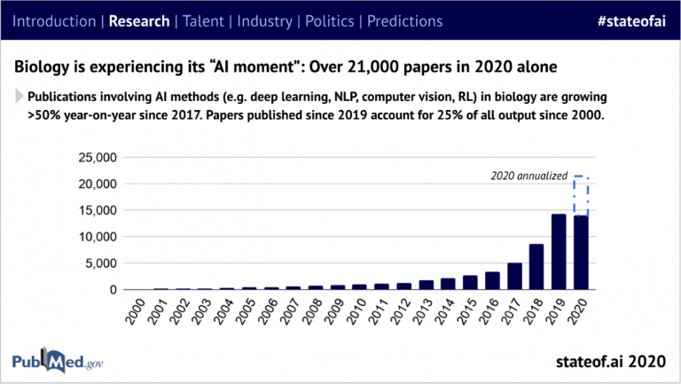

# 우리가 아는 실리콘 밸리는 이제 끝일까?

&nbsp;

`Elon Musk`같은 유명한 기업가들, 벤처 투자자 `Peter Thiel`(_페이팔의 공동창립자_), `Keith Rabois`(_이전 페이팔, 링크드인의 임원_), 그리고 `오라클`, `HP`와 같은 대기업들은 모두 캘리포니아를 떠납니다. zoom이 가능한 테크 관련 종사자들은 원격 근무가 주는 더 싸고 덜 혼잡한 다른 지역사회의 장점을 코비드19 동안 발견했습니다. 이게 우리가 아는 실리콘밸리의 끝일까요? 그럴지도요. 하지만 우위에 있는 실리콘 밸리에게 온 다른 도전은 `테크-대이동`보다 더 근본적입니다.

미래의 실리콘밸리를 만들 수 있는 4개 트렌드를 이해한다면 다가올 10년의 가장 큰 기술 지원(_technology-enabled_) 가능성의 로드맵을 알 수 있습니다 :

1. 소비 인터넷(_Consumer internet_) 기업가들은 생명과학의 혁명을 위해 많은 기술이 필요하지만 부족합니다.
1. 우리에게 달린 인터넷 규제
1. 기후 대응은 자본 집약적이고 본질적으로 지역적입니다.
1. 투자경제의 종말

&nbsp;

## 미래를 만들어내는 것
‘미래를 예견하는 가장 좋은 방법은 `미래를 만들어내는 것`이다.’라고 Alan Kay(_OOP, GUI의 선구자_)가 말했습니다. 2020년은 그가 맞으면서 틀리다고 입증했습니다. `코로나바이러스`에 의한 판데믹, 또는 더 심한 것이 오랫동안 예견되었지만 아직 세상이 준비되지 않았으며, 더 나은 미래는 아직 만들어지지 않았음을 잡아냈습니다. `기후변화` 또한 Arrhenius가 1896년에 만든 온실효과 논문부터 시작해 그저 몇십 년이 아닌 1세기가 넘도록 레이더망에 잡혀있었습니다. 그리고 `불평등`과 `사회 카스트제도`가 사회 안정을 갉아먹고 국가의 운명을 점친다고 오래전부터 알고 있었습니다. 하지만 위기는 항상 우리가 준비되지 않았을 때 찾아옵니다.

개별 사건들은 오랫동안 예측된 미래지만 아직 정해진 운명이 아닙니다. 통제를 넘어선 이벤트에 의해 강제로 밀리든, 힘을 모아 더 나은 미래를 창조하든, 모두 우리에게 달려있습니다. `각성`은 우리가 바라는 것보다 더 늦어졌지만 판데믹과 같은 고비와 기후 변화는 아직 막대한 `혁신의 원동력`이 될 수 있습니다. 만일 기업가, 투자자, 그리고 정부가 오늘날 직면한 어려운 문제들을 해결하기 위해 나선다면 미래는 아직 밝습니다. 하지만 확실한 한가지 : 우리가 가장 급하게 필요한 `변화`는 꼴사나운 마지막을 맞이하는 `소비 인터넷`과 `소셜 미디어 혁명`과는 아주 다른 방향으로 인도할 것입니다.

코로나바이러스는 지금 이 시기의 사건입니다. 속도를 내고있는 생물 의학의 폭발적인 발명은 판데믹 자체를 넘어선 영향을 미치고 있습니다. 기록적인 시간만에 개발된 mRNA 백신은 우리에게 촉망되는 코로나 면역력의 길을 열어주었습니다. 중국인 과학자인 Yong-Zhen Zhang이 바이러스의 유전자 서열을 알린지 불과 이틀만에 Moderna 백신을 만들어냈습니다! 그리고 mRNA 백신은 쉽게 수정할 수 있으며 변이에 더 빠르게 대항할 가능성을 높였고, 더 많은 백신 개발의 속도를 높일 뼈대도 만들 수 있습니다. 우리는 생명의학 혁신의 근본적으로 새로운 접근법, 특히 `머신러닝`이 연구를 빠르게 보조하는(_Turbocharging_) 방식을 지켜보기 시작했습니다. 2020년 동안 21,000건 이상의 생명의학 연구들은 `AI`와 `머신러닝`을 참고하여 만들어졌습니다.

DeepMind는 최근 `AlphaFold` 기술이 단백질 구조를 예측하는 정확도가 `느리고 비싼 실험 방법`에 필적하며 다가올 돌파구의 선구자라고 발표했습니다. 유전학자인 Tim Hubbard는 ‘생명을 위한 청사진인 게놈은 사실상 암호화되어있으며 이건 게놈을 해제하고 생물학적으로 변환하여 생명의학 연구를 변화시킬 것이다.’라고 적었습니다.

### 예견 : 실리콘밸리가 20세기 후반, 21세기 초반에 있었던 것처럼 향후 10년간 머신러닝과 의학, 생물학 그리고 자연과학의 결합은 이어질 것입니다.

왜 이게 우리가 알고 있는 실리콘 밸리의 마지막을 뜻할까요? 먼저, 요구되는 기술이 다릅니다. 네. `머신러닝`, `통계 분석`, `프로그래밍` 모두 필요하지만 `깊은 과학 지식` 또한 필요합니다. 이러한 지식을 찾아낼 수 있는 중추는 실리콘밸리의 특별한 곳이 아니기에 다른 곳들이 주도할 수 있음을 말해줍니다. 두 번째로 부를 창출하는 많은 시장이 정리되었습니다. 정리된 시장을 항해하려면 실리콘밸리에서 눈에 띄게 `사라진 기술`도 필요합니다. 마지막으로 타노스가 확실하게 입증했듯 실리콘밸리에서 번성했던 많은 시장을 유지하는 것보다 합리적인 기업의 `과대광고`를 유지하는 게 더 어렵습니다. 많은 실리콘밸리 투자자들은 머리가 좋은 것보다는 `운`이 좋습니다. 그들은 인기투표에서 이기는 것보다 어려운 문제를 해결하기 위해 자본이 집중되어야 하는 세상에 적응하기 어려울 수 있습니다.

&nbsp;

## ‘우리가 만든 설계의 악마’ 지배하기

과학 연구·개발에서 머신러닝의 기회는 엄청납니다. 하지만 사람이 이론화하고 실험하는 것에 의존적인 보통 접근법에 대한 도전일 수 있습니다. 머신러닝 모델은 성공적으로 예측할 수 있지만 그들에게 불충분합니다. Arthur C. Clarke가 ‘`모든 선진 기술은 마술과 구분되지 않는다.`’고 했을 때 미래의 과학이 우리의 이해력을 넘어섰을거라 상상했을까요? Judea Pearl이 지적했듯 연관성 식별(_예: 수학의 곡선 피팅_)을 과하게 하면 진정한 인과관계의 정의를 어렵게 만듭니다. 그리고 ‘진짜 과학’은 인과관계가 필요하죠.

사람 안구의 허용범위를 훨씬 넘어선 도구를 단순하게 쓰듯 저는 `머신러닝 가능한 과학이 올거라` 예상합니다. 하지만 `머신 헬퍼`들의 더 높은 이해 없이는 소셜미디어와 분열된 정보 환경처럼 우리를 절벽 끝으로 이끌 수도 있습니다.

분열된 환경(_fractured landscape_)은 우리의 예상과는 다를 수 있습니다. 마치 인터넷 선구자들이 예측했던 `자유`와 `대중들의 지혜`가 허위 정보로 이익을 얻는 거대 기업의 엄지 아래 모두 속하게 된 것처럼 말입니다. 우리는 우리가 원하던 것과 다른 것을 만들어냅니다. 인터넷은 우리의 꿈에서 악몽이 되었습니다. 우리는 아직 회복할 수 있지만 적어도 아직은 실리콘밸리가 해결보다는 문제의 일부로 보입니다.

기술 플랫폼은 `우리가 만든 설계의 악마`([Richard Bookstaber의 책](https://digital.kyobobook.co.kr/digital/ebook/ebookDetail.ink?selectedLargeCategory=001&barcode=4801118045589&orderClick=LAG&Kc=))의 고삐를 쥘 수 있을까요? 이것 역시 다가올 몇십 년을 만드는 과제 중 하나가 될 것입니다.

유럽의 규제 담당 정부처와 미국은 페이스북, 구글, 아마존, 그리고 애플을 감시하지만 오래된 이론, 이해에 기반한 규제는 플랫폼이 이미 앞질러버려 충분하지 않습니다. 미국 독과점 금지 이론은 고객 피해 문제에 전적으로 의존해 무료 서비스를 제공하거나 소비자 실험 한계 비용이 0에 가까운 시장에서는 증명하기 어렵습니다. 최근에 만들어진 유럽 규제 노력은 ‘`문지기`’로서 우세한 기술 회사에 적절하게 초점을 맞춰 이윤을 위한 시장 형성 능력에 체계적으로 제한하는 것을 목표로 합니다. 이건 개선책이지만 날카롭지않아 피해를 가늠하기 위한 절차는 그들이 해를 끼치는 것보다 더 느리게 진행될 것입니다.

시장 생태계는 모든 곳에 숨겨진 의존성이 있습니다. 구글의 독점적인 위치를 남용한 피해는 고객에게 첫 번째로 나타나지 않지만 R&D 투자 감소, 구글이 한때 트래픽을 유입시킨 웹 회사들의 낮은 임금으로서 우울한 이득을 봅니다. 아마존은 상품 검색 노출을 위해 인상된 광고 금액을 지불합니다.

실리콘밸리가 장려하는 `승자 독식 모델`에 의한 승자는 다수의 이득을 가져가기 때문에 경쟁 시장 플랫폼들의 공급자에게 이런 손해를 끼치며 마침내 소비자까지 내려오게 됩니다. 하지만 고통은 아주 크게 퍼져있고 플랫폼은 정보가 뚜렷해질 때까지 발표할 의무가 없어 돌이킬 수 없을 때까지 수많은 피해는 확실해지지 않을 겁니다.

‘`슈퍼스타 회사`’들이 `작은 회사`들의 새로운 아이디어와 자비심 없이 경쟁할 때 그들의 인재를 탐낼 뿐만 아니라 상품과 서비스를 흉내 내 만들면 전체 시장에서의 혁신이 줄어들게 됩니다. 도시는 집세를 올리는 새로운 사회 부류인 고임금 대기업 종사자들이 군림하고 낮은 임금의 근로자들을 강제로 내쫓습니다. `수익이 낮은 산업`에서 일하는 사람들의 봉급과 회사 복지는 거대 기업의 성장을 위해 쥐어짜입니다. 이 직군은 근무 초기부터 일자리가 임시적이고 불안정하며 불평등으로 만들어졌습니다. 세금을 피하는 기술에 통달한 대기업으로부터 정부는 `세입`에 굶주리고 있습니다. 리스트는 그것보다 훨씬 깁니다.

소셜미디어 플랫폼은 이익을 위해 사용자들을 속여 `민주주의의 구조`와 `진실에 대한 존중`을 악화시킵니다. 이전에 사용자들의 집단 지성을 썼던 실리콘밸리는 이제 사용자들에 대한 깊은 지식을 사용하여 ‘`그들과 거래`’를 합니다. (벤처 투자자들과 경제학자인 Bill Janeway가 인터넷의 미래를 위해 월스트리트에서 무엇을 배워햐 하는지에 대한 대화 이후 2007년의 광범위한 전환이 있을 거라고 제가 예상했었습니다.)

기술은 유일한 범죄자가 아닙니다. 이건 우리의 사회적인 가치를 비추는 가장 밝은 거울에 지나지 않습니다. Milton Friedman이 1970년에 객관적 기능(_objective function_)을 만들었을 때부터 테크-거물들의 착취적 행동(_extractive behavior_)은 현대 자본주의의 표준이 되었습니다. 하지만 기술 산업이 더 나은 모델을 만들 때부터 더 우울해집니다. `오픈소스 소프트웨어`와 `월드와이드웹`(_WWW_)의 너그러움, `집단 지성`이 알고리즘 적으로 증폭한 천재성이 아직 있습니다. 하지만 잘못된 방향으로 이끄는 시스템의 선로를 타지 말고 우리가 적극적으로 Next Economy(오늘날 기술산업이 이끄는 경제)가 가리킬 방향을 선택해야 합니다.

### 예견 : 플랫폼 사업은 자신을 규제하지 않았기 때문에 이익과 손해에 대한 가능성에 한계가 있을 것입니다.

`젊은 이상주의`의 죽음, 잃어버린 `가능성`을 지켜보면서 실리콘밸리는 슬픈 시간을 보내고 있습니다. DARPA(_미국 국방성의 연구개발기관_)의 전 AI 관리자 Paul Cohen은 몇 년 전 모두 출석했던 국립 과학 아카데미 회의에서 구글, 아마존, 페이스북 같은 회사들이 알고리즘으로 더 야심 찬 목표를 만드는 것보다 `Friedman 원칙`(_'기업의 사회적 책임은 이윤 증대'라고 한 자유 방임주의 경제학자_)에 빠져 많은 잠재력을 허비한다는 강렬한 성명을 냈습니다.

저는 인터넷 문지기들이 보여주는 시장 조직의 근본적인 발전을 말하는 것처럼 AI의 미래 돌파구에 대해 말하는 게 아닙니다. 그 힘은 더 나은 모델이나 모두에게 긍정적인 `복잡한 상호작용 시스템`을 관리하는데 쓸 수 있습니다. 하지만 그들은 오래되고 전형적인 `착취적 패러다임`(_extractive paradigm_)에 너무 자주 굴종해있습니다.

제 뜻을 설명하려면 작은 귀퉁이가 필요합니다.