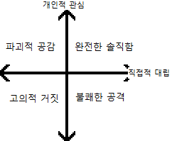
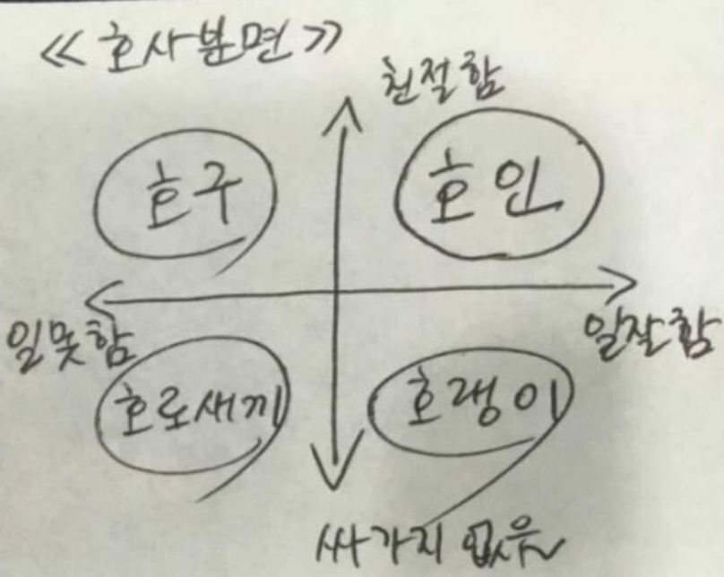

`프로젝트 관리`가 아니고 `인적 관리`에 대한 얘기  
팀장들도 정신과 의사나 보모 역할에 신물나는지 몰랐다. 당연히 _이럴때만_ 들어주는 사람아니었나 ㅎㅎ  
매니저도 사람이다

&nbsp;

# 완전한 솔직함 (Radical Candor)
이게 핵심인데 너무나 단순한 표어로 보인다  
(철저한, 근본적으로) + (직설적, 노골적인 솔직함, 열려있는 마음)  
심플한 단어들로 간단히 치부하기엔 많은 철학이 담긴 용어다

# 인간관계 개론  
> 상사가 모두와 좋은 관계를 유지하려 노력하면 직원들은 갈등을 만들고 싶지않아 지적하지 못한다.  
> 갈등이 배제된 '오직 친절 문화'에서 더 좋은 성과를 만드는건 어렵다.

직장생활에 늘 바라는건 공손하면서도 솔직하고 논리적인 감정을 배제한 토론이다  
의견 표출, 이의 제기가 배제되다 못해 모욕적으로 받아들이는 분위기에 누가 말을 꺼낼까?  

&nbsp;

솔직함은 무례함과 비슷하게 치부되는 경향이 있다.  
의견을 전달하고 받아들이는 방식에서 차이가 생긴다고 이 연사 힘차게 외칩니다

&nbsp;

&nbsp;

예전에 회의에서 높은 직급의 직원이 이유없이 언성을 높인적 있다.  
의견을 피력하기 위한 열정으로 과하게 목소리가 커졌을 수 있지만, 남의 말을 가로막고, 경청하지않고, 자기 말만 우기는 모습은 굉장히 비이성적으로 보였으며 어느 분야의 전문가보다는 마치 공공장소에서 소리지르는 사람을 보는 듯했다  
그렇다. 이성적으로 의견을 논설하고 타당한 이유와 근거들을 내놓는다해도 선택되지 않을 수 있다.  
하지만 소리 지른다고 채택해줄까? 그런 회사라면 도망치자  
어쨌거나 내가 참석한 모든 미팅 중 가장 비상식적이고 비정상적인 회의였다.  
_그리고 나중에 그는 __lay off__ 되었다.._

---

## 조언의 유형

1. **완전한 솔직함**  
    솔직한 칭찬과 확실한 지적  
    구체적인 논지를 명확하게 전달하자.  
    단순 겉햝기가 아닌 세세한 칭찬과 지적이 마음에 울림이 된다  
    > (**X**) 열심히 일 하시네요  
    > (**O**) 매일 관련 책을 읽고 시간을 내어 알고리즘을 풀고, 글쓰는 모습을 보면 저도 노력해야겠다는 자극이 됩니다
2. **불쾌한 공격**  
    뒷담화나 침묵보다 나은 차선책  
    `개인에 대한 공격`과 `공적인 것`(성과, 업무 태도)을 반드시 구별해야한다  
    문제를 개인화하지 말고 근본적 원인과 분석이 필요하다  
    *프롤레타리아 혁명*으로 착각하기 좋다. 확실하게 구별하자
3. **고의적 거짓**  
    아무런 관심과 갈등없이 하는 거짓 칭찬과 지적  
    회사를 영혼없이 다니는게 먼저일까, 고의적 거짓이 먼저일까?  
    그 어떤 신뢰도 쌓을 수 없지만 서로의 입장을 이해하려 한다면 극복 가능하다
4. **파괴적 공감**  
    앞에서 예쁜말만 하는 상사에게 진정한 신뢰를 느낄 수 있을까?  
    갑작스러운 해고 통보나 아무런 징조없이 평가가 낮게 되어있는 등 날벼락을 받을 수 있다

### 사분면 이동하기
1. __먼저 지적받자__  
    _높은 놈이 먼저 당해야_ 팀 내부의 원활한 지적이 가능하다  
    순간의 수치심, 무력감, 공포를 이겨내야 한다  
    인격 모독이 아님을 명심하고 방어적 태도를 지나치게 고수하면 못쓴다  
1. __칭찬과 지적의 균형__  
    완벽한 비율은 없다.  
    의무, 억지 칭찬은 완벽하게 공허한 울림이다. 사람들은 바보가 아니다
1. __개같이 해놨네!__  
    그렇게 부르짖는 잡스의 명언 <`Your work is shit!`>  
    인신공격으로 받아들일 여지가 있거나 괴롭힌다는 인상을 주면 안된다  
    재해석의 여지가 없는 명확한 평가 + 적절하게 걸맞는 이유  
    분명한 지적과 명쾌한 근거라면 통한다

## Just say it!!
보스, 매니저, 리더로서 대립을 피하고 지적을 어려워하면 안된다  
충분한 관심을 기울이고 책임을 다하자.  

&nbsp;

&nbsp;

자주 궁금했다
- 왜 나빼고 이야기하지?
- 저 상사는 내 업무도 파악 못하고 진행 상황 아무것도 모르는데..?
- 말단과는 이야기할 가치가 없나?
- 시작하자 내 의견을 타부서에 전달하는 게임
충분한 의사소통없이 진행시키는건 손실임을 알았을까?

&nbsp;

&nbsp;

조언 4분면을 보며 생각난 짤 하나

---

## 성장 궤도
상황에 따른 관리가 필요하지 가치 판단하는 시간이 아니다  
어차피 이건 시기 따라 바뀐다.

&nbsp;

`직원들에게 꼬리표를 붙이지말라`
1. __고성과자__  
    관심 좀 주세요. 알아서 잘하겠거니 하지말고!  
    더 많은 동기, 더 높은 성과를 위해 투자해야한다  
    어려움을 겪는 이에게 집중하기 쉽지만 해당 유형에 힘쏟는게 팀 차원에서 더 많은 사기를 올릴 수 있다
1. __최고점 찍고 느린 성장__  
    누구나 이런 시기를 겪는다  
    그 동안의 기여를 충분히 `인정`해야한다  
    인정의 흔한 방식인 `승진`은 이들이 원하는 위치에서 이탈시키는 짓이다  
    자신의 시간을 지키고 싶은 사람에게 더 많은 책임, 더 많은 업무가 보상일까?  
1. __최고점 찍고 고속 성장__  
    모든 순간 최선을 다하는 유형  
    새로운 기회를 주거나, 멘토를 붙이거나, 가르치는 역할을 주거나, 승진시키는게 좋다  
    <u>중요</u> : 모두가 승진하고 싶어하지 않는다 (놀라운 사실!)  
    원치않는 승진으로 피할 수 있는 위기를 맞게 하지말자
1. __범재__  
    현재에 안주 : 방전된 배터리는 점프선이 필요하겠지? 성과를 위한 압박이 필요하다.  
    개인 사정 : 적절한 휴가, 휴직  
    `파괴적 공감`은 아무짝에 쓸모없다! 기준을 낮추지말고 확실한 입장을 굳히자  
1. __낮은 성과 + 역성장__  
    진실해지자
    - `완전히 솔직한 조언`했는지?  
        실질적이고 구체적인 방식의 칭찬과 조언을 시도하자  
    - 팀 내부에 어떤 영향을 끼치는지?  
        너가 알 정도면 주변은 진작에 고통이었다
    - 제 3자의 의견  
        자기객관화 잘했나요? 공정함 한 스푼 추가하세요
    헛된 생각
    - 나아질거야    
        어떤 방식의 변화? 어떤 방향의 개선?  
    - 빈 자리보다는 낫지  
        동료들의 고통과 불만은?
    - 전배시켜!  
        = 폭탄 돌리기
    - 분위기 망할걸  
        얘 때문에 진작에 망했는데 뭔 소리해 진짜
    보통 팀 내 최고성과자가 똥을 치울 것이다. 누구를 안고 갈까?  
    버리는 것이 아니다. 다른 기회를 찾아주는거다
1. __급격한 성장과 낮은 성과__  
    응 당신 잘못  
    - 역할 배분  
        적재적소에 배치했는지 가슴에 손을 얹자  
        잘못된 곳에 불시착했다면 허심탄회하게 얘기(_Radical Candor_)하면 그만  
        결말이 보이는데 못 꺾고 요청을 들어줬다면..
    - 적절한 기대  
        예상 범위는 구체적이었는가?  
        교육은 제대로 했는가?  
        업무량은?
    - 개인적 문제  
        `완전한 솔직함`이라면 시간이 필요하단걸 알았겠죠  
        그리고 기다려주는 면모를 보여야한다는걸
    - 문화적 갈등  
        조직 문화와 맞지않는다면 걸맞는 곳으로 보내주자  
        Again, DO THE RADICAL CANDOR
`직원들에게 꼬리표를 붙이지말라`

&nbsp;

유형 설명 위 아래에 들어간 brace를 읽자.  
이는 단지 스펙트럼의 일부일 뿐, 만인불변의 진리처럼 정형화된 편견에 안주하면 안된다. 본인도 변하면서?  
게으르게 방치하거나 넘겨짚지 말고 늘 면밀히 살펴보는 습관을 들이자  
어느 때 무슨 스테이지에 들어갈지 알겠다면 선지자로 이직하자

---

나는 당연히 `고성과자` 내지는 `최고점+급격한 성장`으로 분류되고 싶은 사람이다  
하지만 어느 회사에 있더라도 성장 그래프가 꺾이는 시점이 온다.  
여기서 탈진하느냐 더 불타느냐는 현재 몸담고있는 조직의 분위기와 문화에 영향을 받게 된다.  
전반적인 플로우가 번아웃, 휴식이 될 수 있고 또 다른 도전과 과제를 찾고있을 수 있다.  
전체 흐름을 일방적으로 무시하거나 정말 하나도 영향받지않는 사람은 없다.  
있다면 다른 이들이 그 몫을 떠안고 있겠지