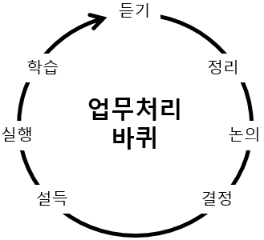

입사한지 얼마안된 차에 `자신이 속한 팀`을 `팀장 앞`에서 솔직하게 평가하는 사람이 얼마나 될까?
> __Q.__ 회사나 팀은 어떤것같아요?  
> __A.__ 더할 나위없이 좋습니다.

# 답은 정해져있으니 넌 입만 열면 돼
구체적인 의견을 제시하는 사람도 있겠지만, `직속 상사`에게 `가식없는 솔직함`을 쉽게 토로할 사람이 많지 않을거다  
중요한건 *입사한지 얼마안된 시점*에 이런 질문을 많이 받는다는 사실이다  
입사하고 꽤 지난 시점에 다시 질문하는 상사는 별로 만나본적 없다  
사실 이런 탐색전은 일방적으로 당하는게 아니고 나도 평가하는 시간인데 쉽지않다  
팀이나 매니저의 성향을 파악하지 못한 채 마주한다면 선택지는 두 개다. _충성_, _아직 잘.._

&nbsp;

난 피드백이 좋다.  
전반적으로 어떻게 생각하고, 어느 부분을 보충하면 좋은지, 어떤게 탁월한지 의견을 나누고 싶다  
하지만 물어보기 겁난다.  
일부러 듣기좋은 소리를 하거나 일부러 혹독한 평가를 내릴 수 있으니까. 어렴풋한 이미지와 평가를 냉정하게 생각할 기회를 주는 것 같고, 내 약점을 구체화시킬 순간을 부여하는 것 같았다.  
간단하게 _책잡힐 기회를 주면 어떡하지?_ 라는 마음이다  

---

# 명령과 지시
성공과 실패는 종이 한 장 차이

## 수동적인 팀을 만드는 방법
- 의사 결정 과정에 배제시키기
- 선택한 결과와 이유를 설명하거나 설득하지 않기
- 독단적인 결정을 내리기

선택한 결론이 현재 상황에 적합하고 타당한 `합리적 결정`이라도 결국 회사는 `인간`이 꾸려나간다.
> 너무 빨리 움직였어요. 기다란 로프를 너무 세게 흔들었어요.  
> 끝에 있는 사람은 필사적으로 매달려야 합니다.  
> 그렇게 흔들고 직원들이 끝까지 버텨주길 바랄 수 없어요.

&nbsp;

## 혹시, 당신 결정만 하지않나요?
축하합니다! 고압적이고 무능한 상사에 당첨되셨습니다

&nbsp;

모두의 의견을 무시하고 본인 생각만 관철시키시는군요!  
팀원들의 의견은 뭘 모르는 멍청이들의 주장이라 치부하시죠?  
당신에겐 `협력`이 쓸모없는 개념이겠네요  

&nbsp;

## 업무처리 사이클 (Get Stuff Done)
일정한 속도로 돌아가는 바퀴

1. __듣기__  
    두가지 방식이 있다
    - 차분한 듣기  
        침묵을 고수하여 사람들의 입장이나 의견을 말하도록 유도  
        악용될 소지가 있으며 모호한 모습을 보이는게 아니다
    - 요란한 듣기  
        먼저 아이디어를 제시하고 의문이나 이의를 듣든다  
        강제로 의견을 말하게 해야한다
    `듣는 문화`만들기
      - 아이디어나 불만을 편하게 제시
      - 의견의 일부는 빠른 처리가 가능하게
      - 왜 오랫동안 체류된 의견이 있는지 단순 설명이 가능하도록
    개개인의 밸런스를 맞추고 적절한 보상과 대안이 있어야 원활한 `듣기`가 가능하다
1. __정리__  
    선택, 제거, 강조를 통한 아이디어 구체화  
    의견을 짓밟지말고 해결책을 제시하자  
    천재적인 아이디어도 듣는 사람을 배려하지 않으면 설득되지 않는다  
1. __논의__  
    차분하자 제발  
    - 자아 표출 금지  
        아이디어를 소유하려 들거나 자존심을 세우는 태도는 안된다  
        반대 의견에서 내 의견을 바라보는 관점도 필요하다
    - 이의제기는 의무  
        침묵에는 강제적 의사 표출도 필요하다. _마치 판사봉을 들면 말해야하는 것처럼_
    - 쉴 땐 쉬자  
        팀원들을 모두 파악했다면(_완벽한 솔직함_) 알기 쉬울 것이다  
        비생산적 페이즈로 들어갈 때 브레이크를 걸어야한다
    - 즐겨. 분위기 파탄내지말고  
        팀장이 먼저 나서서 유한 분위기를 만들고 적극적인 태도를 보여야 한다  
        개개인의 역치를 파악해야만 생산적인 논의가 가능하다
    - 마일스톤  
        회의의 용도가 `논의`인지 `의사결정`인지 정확히 구분하자  
        마감일을 고지해야한다. 혼돈을 만들고 싶지않다면
    - 섣부른 결정 금지  
        논의없는 의사결정 절대 금지  
        결정을 위한 결정 절대 금지  
1. __결정__  
    의견은 이전 단계에서 충분히 했으니 사실을 추려야한다  
    건너들은 것은 사실이 아닌 의견이고 필터링된 정보이니 확실한 사실이 뭔지 밝혀내고 끄집어내야한다
1. __설득__  
    _수사학_ : 설득의 수단으로 문장과 언어의 사용법, 특히 대중 연설의 기술을 연구하는 학문  
    - 감정  
        내 마음말고 청자의 감정  
        정서적 연결고리가 튼튼해야 시작이다  
    - 신뢰  
        전문성과 겸손함
    - 논리  
        남들도 나만큼 알거라 간과하지 말자  
        적극적으로 생각을 공유하고 자신이 어떻게 구체화했는지 보여주자
1. __실행__  
    때가 왔다  
    협력만 치중해 개인의 업무시간을 뺏으면 안된다  
    실무와 관리의 밸런스를 맞추고 실질적이고 구체적인 조언, 도움을 주자  
1. __학습__  
    사랑하되 집착하지 말라.  
    사실을 인정하고 성과와 경험을 거름삼자  
    조직 전체의 번아웃에서 관리자부터 빠져나와야 팀 회생의 시작이다

&nbsp;

성공한 똑똑이들도 현실을 부정하면 실패가 뒤따른다.  

일례로 구글은 승진 대상에 본인이 지원하고 이는 별도로 구성된 승진위원회에서 결정한다.  
팀장과 팀원의 합이 맞지않을 수 있고, 팀장에게 알랑대는 사람이 일방적인 승진을 하지않도록 회사 차원에서 방지하는 것이다  
실로 멋진 절차  

> 직원들의 요구 사항에 귀를 닫아버릴 수도 있다.  
> "지금은 그 문제를 해결할 시간이 없어!"

> 배를 만들고 싶다면 사람들에게 나무를 모아오라고 지시해선 안 된다. 과제와 업무를 할당하지 말고, 그들이 바다의 무한함을 꿈꾸도록 만들어야 한다.
> 
&nbsp;

&nbsp;

# 출처
> [수사학](https://ko.wikipedia.org/wiki/%EC%88%98%EC%82%AC%ED%95%99)