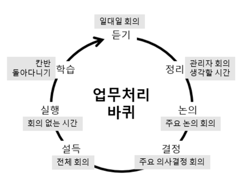

# 진정한 관계 구축
우리 사이 가식없는 사이

1. __성장 과정__  
    중요한 시기에서 선택과 이유를 알면 가치관을 엿볼 수 있다  
    하지만 선은 넘지말자
1. __포부__  
    입에 발린 대답을 원하지 않겠지  
    `원하는 커리어의 최종형`은 진솔한 대답을 끌어내기 좋은 질문이다  
1. __차후 계획__  
    꿈을 위한 단기 계획은?  
    현재 업무와 밀접하게 연관시키면 윈-윈

# 회의
GSD를 잊지않았겠지

1. ## 일대일 면담
    공손하고 정중한 태도  
    경력이나 성과에 대한 주제로 안건은 팀원이 들고오게  
    커피나 점심, 산책이 더 진솔한 대화를 할 수 있다  
    20분이라도 주기적으로 진행하자.  

    &nbsp;

    __위험신호__
      - 이메일로도 가능한 이야기
      - 좋은 얘기만 한다면 불편하거나 쓸모없다 생각하는 것이다. 부정적 이야기도 요구하라
      - 상사에게 지적하지 않는다 = 무언가 잘못됨
      - 안건이 없다 -> 왜 이야기할게 없는지 물어보자
2. ## 관리자 회의
    두세명만 열심히 말하고 나머지는 멍하니 있는 상황은 최악  
    `주요 사항 업데이트`, `의사결정 확인`, `다음 주기 체크`면 끝!

    &nbsp;

    1. __배우기__  
        주요 업무의 진행사항과 이유 파악  
        담당자들이 직접 자료를 업데이트하게 한다
    1. __듣기__  
        팀 별 업무와 담당자, 고지 사항 3-5가지  
        이 것만 문서로 공유하면 시간 낭비가 없다  
    1. __정리__  
        팀원들이 상황 파악할 수 있게 돕자  
        의사결정과 논의사항을 분류하고 제안자를 알린다  
        참석을 원하는 회의를 지원받자
3. ## 생각할 시간  
    쉽게 간과하지 말자. 이 시간이 있어야 생산성도 높아진다  
    일정에 질질 끌려다니고 싶지 않다면 미루지말자
4. ## 주요 논의 회의
    의사결정이 아닌 토론 시간  
    회의의 목적을 분명히 밝혀야 같은 입장이 된다  
    참석, 참관을 원하는 사람들이 모두 입장한다  
    서로 역할을 바꿔보면 지위와 자존심을 내려놓을 수 있다
5. ## 주요 의사결정 회의
    `결정 요약 자료`를 관련된 모두에게 공유  
    결정을 번복하면 무한루프 시작이다  
6. ## 전체 회의
    100명이 넘는 규모에서 실시하는게 효율적이다

    &nbsp;

    1. __프레젠테이션__  
        올바른 방향의 의사결정임을 알리자  
        관심가질 1,2가지 프로젝트에 집중한다  
        담당팀이 직접 진행하게 만든다
    1. __이의제기__  
        *더 높은 놈*이 듣고 질의응답  
        어려운 질문에 제대로된 답을 하면 프레젠테이션보다 효과적이다  
        거칠고 이상한 질문이라도 대답해야한다
7. ## 회의없는 시간
    회의의 늪에 업무도 못할 지경  
    `생각할 시간`을 양보하지말자
8. ## 칸반
    `해야할 일`, `진행 중`, `완료한 일`로 나눈다  
    책임 소재, 도움이 필요한 일, 도움을 줄 수있는 것을 분류할 수 있다  

    &nbsp;

    이는 타팀 업무를 파악하고, 이기심과 질투를 없앨 수 있는 수단이다  
    공식적이고 공정한 평가이기에 납득 가능한 승진과 성과 평가에 도움된다  
9. ## 사무실 배회
    일주일에 1시간만 돌아다녀도 좋다. 짤막한 대화를 나누자  
    불만을 늘어놓는 것보다 나서서 고치는 문화를 만들 수 있다  

    &nbsp;

    1. __사소한 문제 파악__  
        중요도가 떨어져 보고 못한 문제가 많다  
        사소한 문제가 점점 커지면 큰 결함의 소지가 될 수 있다
    1. __적극적 태도__  
        사소한 문제를 무시하지 않고 나서서 해결하자  
        팀원들도 사소한 결함을 무시하지 않을 것이다  
    1. __만족도__  
        사소한 일에 관심을 보이면 중요한 문제도 함께 해결된다

---

# 팀장 = 팀 문화
1. *골드만삭스 CEO 밥 루빈*은 한 영업소에서 "_나도 금을 좋아한다_"고 말했다.  
    몇 주 뒤 회사는 금을 대량으로 매입했다.  
    이유는 "_너가 그래서 해야되는 줄 알았다_" 
1. 모두가 애타게 부르짖는 *애플의 잡스*는 "*회사 셔틀버스 내부를 교체하라*"해서 운행이 연기됐다  
    당연히 루머  
    별개로 결정된 셔틀 내부는 잡스 차의 인테리어를 참고했다  
1. 한 관리자는 영업사원에게 "_난 옥스퍼드 흰 셔츠가 좋아보인다_" 했다  
   그 사람은 일주일 내내 옥스포드 재질의 흰 셔츠를 입고 출근했다 

나에게 의미없는 짧은 대화도 직원들은 다르게 받아들일 수 있다  
관리자는 나노 단위로 파해쳐지는 직위임을 잊지말자  

- __요점 정리__  
    분명한 전달을 위해 끊임없이 노력해라
- __포기하지마라__  
    모든 결정들이 밀려온다 (_행사 이름은? 인테리어는? 회의실 개난장판이던데?_)  
    미루고 싶겠지만 직접 결정해라  
- __사소한 설득__  
    요청받은 종류의 커피와 티백만으로도 긍정적 평가를 받을 수 있다  
    최고급 요리사, 넓은 공간, 멋진 인테리어 없어도 된다
- __철학적 실행__  
    별 의미없는 행동도 관리자가 나서면 좋은 규범이 될 수 있다  
- __실수에서 배우자__  
    변화를 추진하는 건 상사 몫이다  
    좋은 의도라도 변질되었다면 새로운 것을 찾아 떠나자  
- __자가 복제__  
    굳이 설파하지 않아도 각 팀의 개성에 따라 잘 정착된다  
    모든걸 감독하지 않아도 된다

---

# 최종 정리
- 원하는 전략에 맞는 에피소드를 공유하거나 책을 홍보해도 좋다  
- 먼저 모범을 보여야 한다  
- 매일 노력하고 실천하자
- 만만한 놈부터 잡고 경력대화, 일대일 회의를 시도하자
- 직원들의 성향에 따라 방식을 다르게 해야한다
- 냉정한 평가
    - 조언을 주고받는데 진전이 있는가?
    - 팀원들을 더 잘 이해했는가?
    - 일대일 회의에 만족하는가?
    확신이 들때까지 새로운 시도 금지
- 회의 애티튜드
    - 뒷담화 안 듣겠다고 확실히 말해라
    - 필요한, 필요없는 회의들을 분류하자
    - 서로의 조언을 팀원끼리 평가하자
- 분위기 영 아니라면 다시 처음부터

이상을 끝까지 밀고 나가자

---

# 후기
> 세상 모든 기쁨을 앗아가는 끔찍한 팀장 아래서 지독하게 지겨운 일과 씨름하는 고통을 안다.  
> 이는 개인적인 삶까지 치명적인 영향을 미친다.
&nbsp;

회사 생활에서 생기는 정말 수많은 불만들이 왜 생겨났는지 시원하게 알 수 있었다  
늘 전달의 연속. 내가 타부서 담당자를 만나면 큰일나는줄 알았다. 거의 메두사급

관리의 부재와 악용은 퍼포먼스 저하에 아주아주 심각한 원인 중 하나이니 중요한 문제지만 꽤나 간과되고 과소평가된다고 생각한다

&nbsp;

그래도 한국 문화에 Radical Candor가 도입되면 참 좋겠다는 희망을 가진다  
이미 차용한 회사가 있겠지만 당연히 주류감성은 절대 아닐테고 기성세대, 심지어 MZ까지도 반발을 살 것 같다. 기본 컨셉 자체가 열정이다 보니 먹고 살려고, 인질 잡혀 마지못해 다니는 사람들에겐 힘들 수 있다.  
사실 그런 사람들마저 포용하는 개념이지만 먼저 관리자가 `그렇게까지` 노력 가능한지 시작해봐야 한다  

성공한 똑똑이들도 현실을 부정하면 실패가 뒤따른다.  

> 배를 만들고 싶다면 사람들에게 나무를 모아오라고 지시해선 안 된다. 
> 과제와 업무를 할당하지 말고, 그들이 바다의 무한함을 꿈꾸도록 만들어야 한다.

함께 일하기 위해 의견을 물어보고 수용하는 자세를 보인다면 하늘에서 강림한 상사 아닐까?  

`일`이야말로 팀원들 모두를 이어주는 연결 고리다. 딴데서 찾을 필요없다  
모두가 이득인 방식으로 협력하면 결속력은 자동으로 따라온다.0

토론과 논의가 없는 환경에 대뜸 의견을 내라면 *밥줄이 걸린 일*에 *무지성 저격*을 하라는 뜻일 수 있다.  
하지만 열린 마음으로 먼저 의도를 밝히고 경청하는 자세를 보이면 시작할 수 있다

조언을 시간낭비라고 생각하지말자 당신이 파악하지못한 범위에서 더 많은 시간낭비가 이루어지고 있으니까  

일례로 구글은 승진 대상에 본인이 지원하고 이는 별도로 구성된 승진위원회에서 결정한다.  
타 팀의 사람을 대상으로 한다  
팀장과 팀원의 합이 맞지않을 수 있고, 팀장에게 알랑대는 사람이 일방적인 승진을 하지않도록 회사 차원에서 방지하는 것이다  

> 세상의 모든 기쁨을 앗아가는 끔찍한 팀장 아래서 지독하게 지겨운 일과 씨름하는 고통이 어떤 것인지 나는 잘 안다. 이러한 고통의 가장 치명적인 부분은 내 개인적인 삶에까지 지대한 영향을 미친다는 사실이다.

그 비대한 자아를 드러낼 시간  

> 훌륭한 인재가 쉽게 나쁜 상사로 전락하고 불행의 원천이 된다  
> 더 나은 상사로서 더 많은 성공과 행복을 바란다

&nbsp;

왜 이렇게 반복되는 말들이 많은지.. 2부는 아주 곤욕이었다  
주장을 반복하고 반복하고 비슷한말 돌려말하고 유추 가능한 내용들을 굳이굳이 또 보여주고    
1부만 읽어도 충분하고, 이해가 안될 때 2부를 읽으면 된다. 사실 1부도 논증을 위한 장치가 많아 이해가 안될리 없다  
오탈자가 많고 띄어쓰기도 되다 말았다  

&nbsp;

책없이 [여기 페이지](https://www.radicalcandor.com/resources/#videos)만으로도 개념 설명은 충분하다  

&nbsp;

&nbsp;

# 출처
> 스콧 킴. (2019). 실리콘밸리의 팀장들:까칠한 인재마저 사로잡은 그들의 지독한 솔직함. 청림출판사. 9788935212828