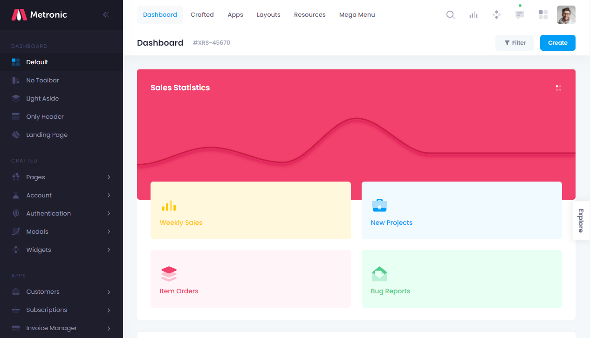
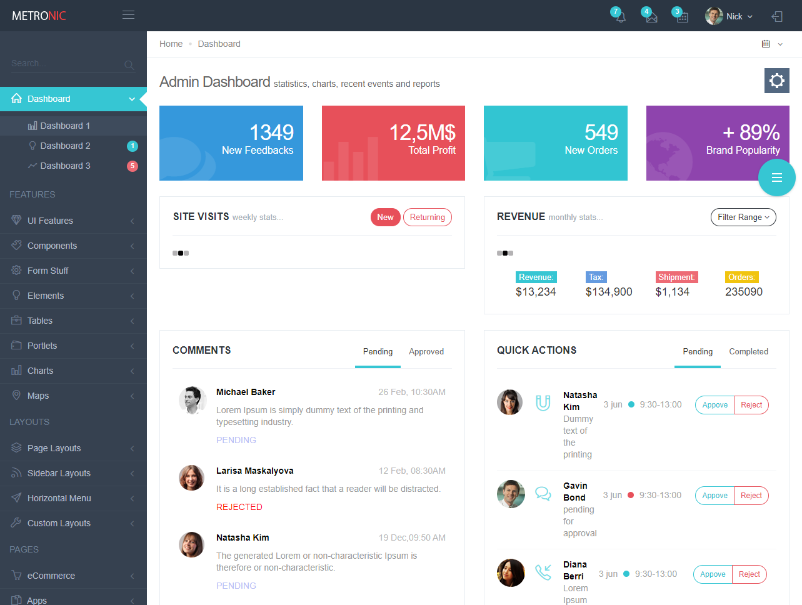

때는 2010년대 `Bootstrap 3`이 풍미하고 있던 시절,  
부가 유료 theme없이 네이티브만으로도 멋지던 그 때.

아직 그 디자인을 사용하는 프로젝트가 있다면 어떨까?  
_믿기지 않겠지만 많다._  

1. 레거시 사랑  
    아직 누가 3을 쓰고 있을까..?  
    심지어 새로운 프로젝트에도 쓴다하면 어떨까?  
    과거의 영광이 프로젝트화된다면 이걸까?
1. 버전업 문제  
    이미 통째로 이식했기에 연관된 스크립트가 쌔고 쌨다 (aka 불가능)  
    뒷목의 안부를 묻게된다

&nbsp;

[Bootstrap](https://getbootstrap.com/)은 현재 5.1.1버전을 서비스한다  
[metronic](https://keenthemes.com/metronic/)이라는 theme을 함께 사용하는데 현재 5 기준 서비스되고 있다  

*[metronic8 default dashboard demo1](https://preview.keenthemes.com/metronic8/demo1/index.html?_ga=2.170569824.1519457692.1631668186-192319790.1631668186)의 캡쳐본*

*[metronic4 admin1](https://preview.keenthemes.com/metronic-v4/theme/admin_1/)의 캡쳐본*  
3버전 샘플은 도저히 찾을 수가 없다😢  

예쁘다..  