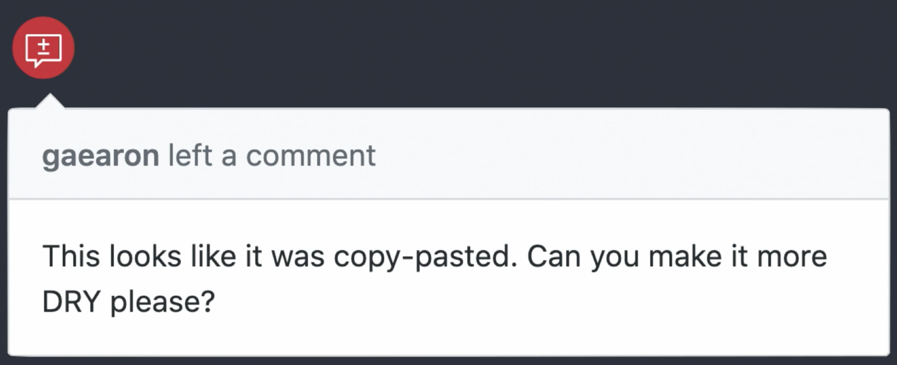
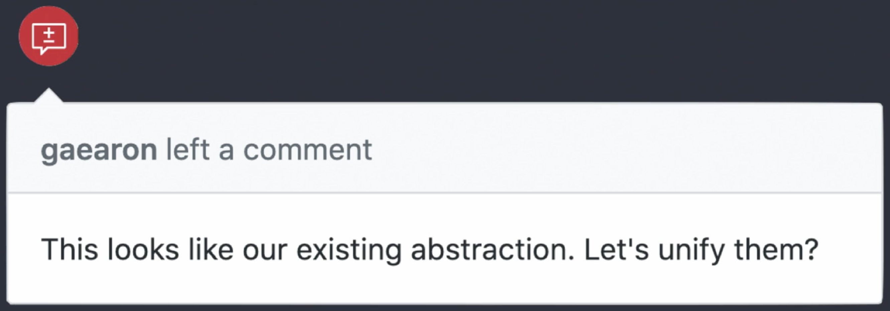
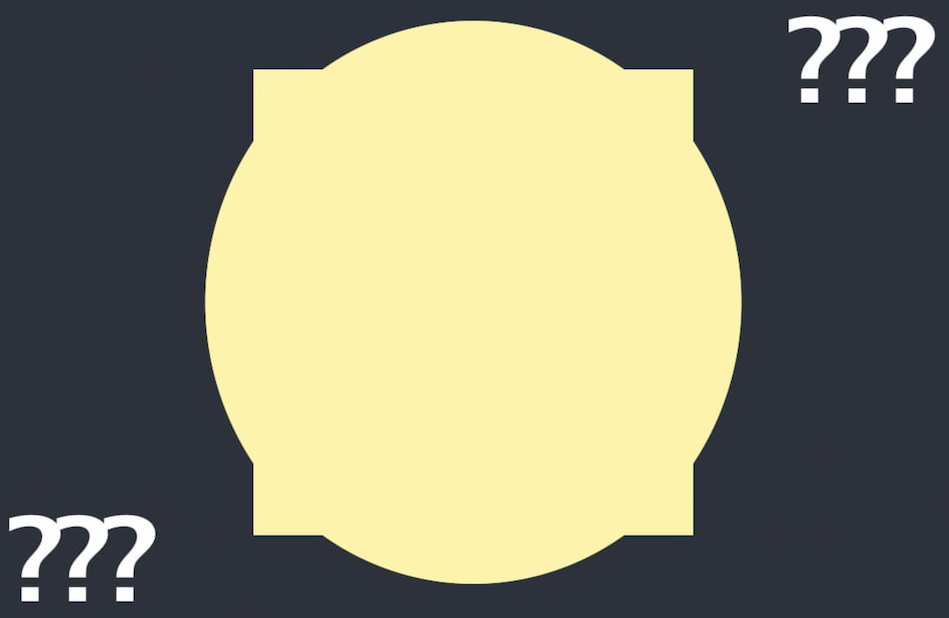

안녕하세요. 전 많은 물을 마시는 법을 배웠습니다. 제 이름은 Dan Abramov입니다. 전 리액트라고 불리는 자바스크립트 라이브러리를 위해 일합니다. 사실 이번이 자바스크립트와 리액트에 대해 연설하지 않는 첫 번째 컨퍼런스입니다. 이 중 리액트를 써본 적 있는 사람이 있는지 궁금한데요, 알겠습니다. 네. 많은 분이 리액트를 씁니다. 멋진 일이죠. 지금은 리액트에 대해 말하지 않습니다. 만일 타임머신으로 과거의 나에게 간다면 전 기꺼이 말할 것입니다. 멀리, 멀리 떨어진 깊은 바닷속 코드 베이스에 대한 이야기 말이죠.

&nbsp;

이건 제가 아주 예전에 작업한 코드 베이스로, 모듈과 파일이 2쌍 있는 소스 코드였습니다. 그리고 동료와 친구들은 하나의 파일에 새로운 기능을 만들고 있었죠. 그런데 개발하는 새로운 기능이 이미 다른 파일에 아주 비슷하게 구현되어 있다는 걸 그들은 알아차렸고 _흠, 저렇게나 같은 건데도 왜 나는 코드를 복사해 붙이지 않을까?
_라고 그들은 생각했죠.

&nbsp;

그들은 제게 코드 리뷰를 부탁했습니다. 전 모범 예제들에 대한 모든 책_(실용주의 프로그래머, 클린코더, 잘 정돈된 코더)_ 그리고 제가 알기로 필요했던 _--복사해 붙여넣기 코드는 유지보수의 부담이 증가하기 때문에 꽤 어렵더라도 복붙해선 안된다._ 전 반복하지 말라는 뜻의 머리글자인 DRY_(Don't Repeat Yourself)_를 갓 배웠었습니다. 전 이게 복사해 붙여넣기같이 보였고 그래서 DRY를 조금 해보지 싶었습니다.

&nbsp;

제 동료는 마치.. 네. 당연히 전 추출한 코드로 별도의 모듈을 만들어 기존 파일들을 여기에 의존적으로 만들었고 그렇게 추상화가 태어났습니다. 추상화는 당신이 어떤 언어를 쓰는지 중요치 않습니다. 이건 코드 베이스의 여러 장소에서 재사용 가능한 `function`이나 `class`, `모듈`, `패키지`같은 것들입니다.

&nbsp;

이건 좋아 보였고 그들은 영원히 행복하게 살았습니다. 그러니 이제 어떻게 추상화가 발전됐는지 봅시다. 다음 일어난 일은 새로운 기능을 개발하면서 잠깐 보지 않았던 그 코드와 아주 비슷한 것이 필요했습니다. 그건 원래 추상화와 달리 동기적이라는 것을 제외하고 거의 같은 모양이 필요했죠.

&nbsp;

그리하여 우린 그 코드를 직접적으로 재사용할 수 없었지만 살짝 다른 점을 제외하면 딱 같은 코드였기 때문에 복사 붙여넣기 하는 정말 나쁜 기분이 들었습니다. 그리고, 음, 반복하면 안 될 것 같아서_(Shouldn't reapt ourselves)_ 두 부분을 합쳐 우리의 추상화를 조금 더 멋지게 만들어 이번에도 처리할 수 있었습니다. 우린 정말 좋은 기분이었습니다. 정통은 약간 아니지만, 실생활에서 이런 코드를 만난다면 어떤 일이 일어나겠어요? 그렇죠? 약간의 타협안을 만들겠지만 적어도 코드를 복제해야 하진 않습니다. 왜냐면 그건 나쁠 거니까요, 맞죠?
