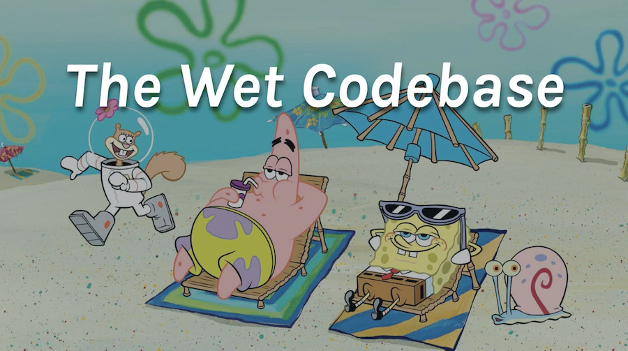
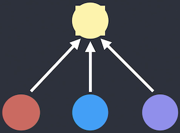
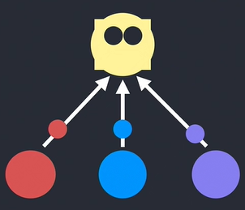

안녕하세요. 전 많은 물을 어떻게 마시는지 배웠습니다. 제 이름은 Dan Abramov입니다. 리액트라고 불리는 자바스크립트 라이브러리를 위해 일하죠. 사실 이번이 자바스크립트와 리액트에 대해 연설하지 않는 첫 번째 컨퍼런스입니다. 이 중 리액트를 써본 적 있는 사람이 있는지 궁금한데요, 네. 많은 분이 리액트를 씁니다. 멋진 일이지만 지금은 리액트에 대한 게 아닙니다. 만일 타임머신을 타고 과거의 나에게 갈 수 있다면 이걸 말해줄 겁니다. 멀리, 멀리 떨어진 깊은 바닷속 코드 베이스에 대한 이야기를 말이죠.

&nbsp;

이건 제가 아주 예전에 작업한 모듈과 파일이 2개씩 있는 코드 베이스입니다. 제 동료와 친구들은 하나의 파일에 새로운 기능을 만들고 있었죠. 그런데 그 새로운 기능이 이미 다른 파일에 아주 비슷하게 구현되어 있다는 걸 알아차렸습니다. 그리고 _흠, 저렇게나 같은 건데도 왜 나는 코드를 복사해 붙여넣지 않을까?_라고 생각했죠.

&nbsp;

그리고는 제게 코드 리뷰를 부탁했습니다. 전 모범 예제들에 대한 모든 책_(실용주의 프로그래머, 클린코더, 잘 정돈된 코더)_ 그리고 제가 필요했다고 알았던 _--복제한 코드는 유지보수의 부담이 증가하기 때문에 꽤 어렵더라도 '복사 & 붙여넣기'해선 안 된다._ 전 반복하지 말라는 뜻의 머리글자인 DRY_(Don't Repeat Yourself)_를 갓 배웠었습니다. 전 이게 마치 `복사 붙여넣기`같이 보였기 때문에 DRY를 조금 적용해보고 싶었습니다.

&nbsp;

제 동료는..  네, 당연히 전 추출한 코드로 별도의 모듈을 만들고 기존 파일들을 의존적으로 만들었습니다.  그렇게 추상화가 태어났습니다. 추상화는 당신이 어떤 언어를 쓰는지 중요하지 않습니다. 이건 코드 베이스의 여러 군데서 재사용할 수 있는 `function`이나 `class`, `모듈`, `패키지`같은 것들입니다. 

&nbsp;

적용된 결과는 좋아 보였고 그들은 영원히 행복하게 살았습니다. 그 후 어떻게 추상화가 발전됐는지 말해드리자면 우리는 새로운 기능을 개발하면서 잠깐 내버려 두었던 추상화와 아주 비슷한 게 필요했습니다. 원래 비동기적이었지만 이번엔 동기적이라는 걸 제외하면 거의 같은 모양이 필요했죠. 

&nbsp;

직접적으로 이 추상화를 재사용할 수는 없지만 약간 다른 점을 빼면 정말 같은 코드였기 때문에 `copy & paste`하는 좋지 않은 기분이 들었습니다. 그리고, 음, 반복하면 안 될 것 같아서_(Shouldn't repeat ourselves)_ 두 부분을 합쳐 추상화를 좀 더 멋지게 만들어 이번에도 해낼 수 있었습니다. 우린 정말 좋았죠. 정통은 좀 아니지만 실제로 이런 코드를 만난다면 어떤 일이 일어나겠어요? 그렇죠? 약간의 타협안이 필요하겠지만 적어도 코드를 복제해야 하진 않습니다. 왜냐면 그건 나쁠 거니까요, 맞죠? 

&nbsp;

다음 찾아낸 일은 새 코드, 새 기능에 버그가 있었습니다. 정확히 똑같은 코드가 필요하다고 생각했지만 사실 조금 다른 것이 필요해서 생긴 버그였죠. 새로운 케이스를 추가하여 당연히 버그를 고칠 수 있었고 우리의 추상화는 `if문`을 가질 수 있습니다. 만일 이게 특이 케이스라면 다른 작업을 해야 합니다. 네, 두 개를 연결하면 좋을 겁니다. 왜냐면 모든 추상화에서 일어나는 일이기 때문이죠. 그렇잖아요?

&nbsp;

우리는 원본 코드에도 버그가 있는걸 알아챘습니다. 2개의 케이스가 같은 줄 알았지만 조금 달랐던걸 당시 알아차리지 못했을 뿐입니다. 다른 특이케이스를 추가하면서 저희의 추상화는 좀 이상하고 위협적으로 보였습니다. 그래서 아마도 더 포괄적으로 만들기로 했습니다. 왜 우리는 추상화에 모든 특별한 경우를 넣었을까요?

&nbsp;

실제 use case들에 속해있던 추상화를 모두 빼냈습니다. 보기엔 이렇습니다. 이제 추상화는 모든 실제 케이스들과 무관합니다. 정말 일반적이고 아주 아름답죠. 아무도 이게 어떤 걸 대표하는지 더이상 알지못합니다. 아, 그건 그렇고 이제 다른 위치에서 매개 변수화되었으니 모든 코드 사이즈에서 매개 변수화되었는지 반드시 확인해야 합니다.

&nbsp;

하지만 각 단계의 코드를 작성하거나 리뷰하는 사람들만 이해할 수 있는 정도의 작은 변화였습니다. 그렇게 그대로 방치되었고 시간이 흐르면서 어떤 사람들은 팀을 떠났고 또 어떤 사람들은 팀에 들어왔습니다. 많은 fix가 있었고 누군가는 추상화에 수정을 조금 해야 했습니다. 전 정말 뭘 해야 할지 몰랐지만 조금씩 고치고, 새로운 기능을 추가하고 연산을 향상했습니다. 그래서 우리는 이런 결과에 이르렀습니다.

&nbsp;

다시 말하지만 각 단계에서는 나름대로 괜찮았습니다. 하지만 원래 하려던 일을 놓친다면, 순환적인 종속성(_cyclical dependency_)이 있는데 모른다거나 구석진 곳에서 이상한 게 자라나는 사실을 모르게 됩니다. 단지 큰 그림을 더는 못 볼 뿐인데 말이죠. 당연히 실생활에서는 아무도 코드 베이스를 건들지 않을 것이고 긴 시간 동안 썩어있던 코드를 누군가가 새로 짜면서 이야기는 끝났겠죠. 그리고 아마도 승진했을 겁니다. 모르죠.