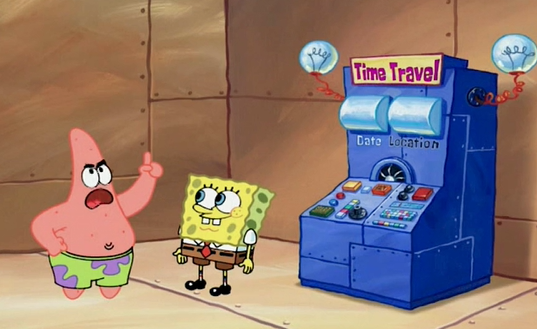
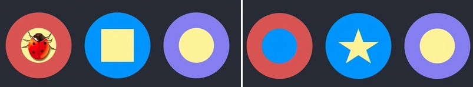
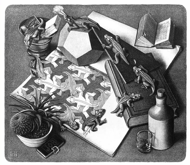
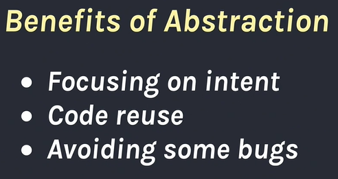

만약 타임머신이 있다면 과거로 돌아가서 고칠 수 있을 거예요, 그렇죠? 전 추상화가 아직 의미 있었던 곳으로 돌아가고 싶습니다. 예상치 못한 케이스가 있고, 조금 다른 게 필요하더라도 우린 코드를 복제하기 정말 싫었습니다. 그리고 네, 물론 추상화를 보완, 보충하면서 이상하게 완성되겠죠. 지금의 내가 거기 있었다면 제발 이 추상화를 바로 처리(_`inline`_)하라고 말할 겁니다.

&nbsp;

`inline`은 말 그대로 코드를 가져와서 붙여넣는 것을 뜻합니다. 약간의 중복을 만들지만 개발하다가 만들 수 있는 괴물을 파괴합니다. 당연히 복제는 장기적으로 완벽하지 않지만 잘못된 추상화 또한 장기적으로 완벽하지 않습니다. 따라서 우리는 2가지 문제의 균형을 잡아야 합니다. 만일 버그가 있고, 어떤게 사실 다른 일을 해야 한다고 깨달았다면 이 방법은 그냥 우리가 바꿀 수 있게 도움을 줍니다. 독립되어있기 때문에 다른 위치에 영향을 끼치지 않습니다. 비슷하게 다른 버그가 생겨 다시 변경해야 할 수도 있겠죠.

&nbsp;

저는 늘 `복사 붙여넣기`를 해야 한다고 제안하는 게 아닙니다. 아마 더 장기적인 관점에서 각 파트가 안정되고 의미있다고 깨달을 수도 있습니다. 원래 생각처럼 좋은 추상화가 아니라서 어떤 것을 빼내야 할 수도 있습니다. 뭔가 다를 수도 있죠. 그리고 이게 실제로 얻은 것만큼이 좋을 수도 있습니다. 만일 제가 혹독한 추위를 모르는 작고 귀여운 시절에 들었다면 틀렸다고 했겠죠. 전 복사 붙여넣기가 정말 안 좋다고 들었으니까요.

&nbsp;

그리고 제가 보기에 이건 사실상 자기 자신에 의해 영원히 계속되는(_self-perpetuating_) 순환입니다. 개발자들은 경험에서 우러나온 실제 문제들과 해결법들이 있기 때문에 이전 세대의 모범 사례들을 배우고 따르려 합니다. 하지만 모든 전후 사정과 균형 관계를 설명하기는 어렵기 때문에 모범 예제들의 발상과 안티패턴은 단일화됩니다.

&nbsp;

왜 그런 균형과 결론에 도달했는지 새로운 세대가 이해하지 못한다면 흐름을 파악하지 못해 이것이 나쁜 아이디어인지, 얼마나 확장성이 있는지 결정할 수 없습니다. 그렇게 모범 예제와 안티 패턴을 극단적으로 시도하게 되면서 자신들만의 문제에 부딪힙니다. 그리고 다음 세대에게 가르치면서 이 순환은 깨지지 않고 반복해서 일어날 가능성이 큽니다.

&nbsp;

제 생각에 이 악순환을 끊을 방법은 다음 세대에게 가르칠 때 단순히 이차원적으로 모범 예제와 안티패턴이 있다고 하는게 아니라 실제로 다루는 게 어떤 건지, 아이디어의 이점이 뭐고 비용이 뭔지 설명해야 합니다. 우리가 추상화의 이점에 관해 얘기할 때, 당연히 이건 이점이 있습니다. 모든 컴퓨터는 막대한 추상화의 스택이고 구체적으로는 추상화를 통해 특정 의도에 집중할 수 있게 합니다, 그렇죠? 만약 당신이 이 개념을 알고 있다면 그들의 머릿속에 계속 남아있게 해야 합니다.

&nbsp;

특정 계층에 집중할 수 있는 건 정말 좋습니다. 코드를 여러 장소에 가지고 있고 어떤 이메일을 보낸 뒤 _--이메일이 어떻게 보내지는지 알고 싶지 않을 때 말이죠._ 심지어 메일이 도착하는 게 저에겐 의문입니다. 하지만 전 이메일을 보내는 함수를 호출할 수 있고 거의 모든 시도에 동작합니다. 하나에 집중하기 정말 좋은 거죠. 또 다른 이점은 당신이나 다른 사람이 만든 코드를 재사용할 수 있고 실제로 어떻게 동작하는지 기억할 필요가 없다는 점입니다.

&nbsp;

만약 다른 데서 쓰는 것과 정확히 같은 게 필요하다면 이건 재사용하기 정말 멋질 겁니다. 이건 추상화의 장점이죠. 추상화는 어떤 버그들을 피할 수 있게 합니다. 예를 들어 버그가 있는 지점에서 복사 붙여넣기를 했습니다. 여기엔 복사 붙여넣기에 대한 논쟁이 있지만, 어쨌든 하나의 버전 안에서 버그를 찾아내 고쳤습니다. 하지만 다른 버전은 여전히 망가져 있겠죠. 이 사실들은 무언가를 추출하거나 빼내는 것에 대한 좋은 논거가 될 수 있습니다.