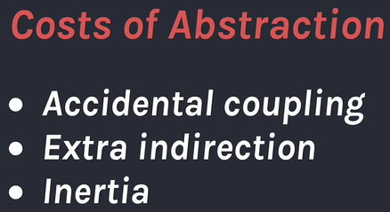
우리가 이득에 대해 말하면 비용에 대한 이야기도 해야 합니다. 추상화의 비용 중 하나는 우연한 결합을 만들어내는 것입니다. 제 뜻은 이러합니다. 어떤 추상화와 두 개의 모듈을 쓰면서 모듈 중 하나에 버그가 있다는 걸 알아차렸고_(1)_, 문제의 코드가 추상화 안에 있기 때문에 추상화를 수정해야 합니다._(2)_ 하지만 이 추상화를 호출하는 모든 장소를 고려하면서 다른 코드에 수정했는지, 다른 부분에 버그가 생겼는지 등을 확인하는 건 당신의 책임입니다._(3)_ 이건 하나의 비용이고 아마 당신은 감내할 수도 있겠죠. 대부분의 사람이 그렇게 하죠. 하지만 이건 실제적인 비용입니다.
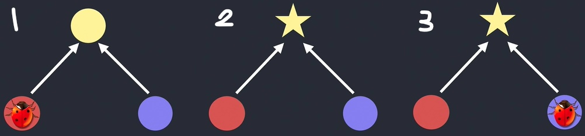

&nbsp;

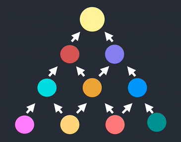
그리고 제 생각에 더 위험한 비용은 추상화가 낳는 부가적인 간접 행동입니다. 추상화란 약속은 구체적인 계층에 집중할 수 있지만 사실 모든 계층을 신경 써야 합니다. 이게 정말 일어나는 일일까요? 하나의 레이어를 시작했던 곳에 아마도 대부분 버그가 있을 겁니다. 버그 때문에 해당 레이어와 다른 레이어를 이해하는 게 필요하고 이건 다른 모든 레이어를 관통하는 것입니다. 우린 우리의 머릿속에 정말 제한된 스택을 가지고 있죠.

&nbsp;

당신이 가진 스택은 무너질 거고 이게 바로 사이트가 그런 식으로 코딩된 이유일 겁니다. 그 뒤 스파게티 코드를 만들지 않으려고 너무 필사적으로 노력하는 바람에 더는 어떻게 되어가는지 모르는 레이어가 너무 많아지면서 라자냐 코드가 탄생하는걸 수없이 봐왔습니다. 이게 바로 추가적인 간접 행동입니다. 그리고 만일 그것들을 변경하기 쉽게 한다면 썩 나쁘지는 않을 겁니다.

&nbsp;

더해서 추상화는 당신의 코드 베이스에 무력감을 만듭니다. 이건 기술적인 시선보다는 사회적 문제죠. 
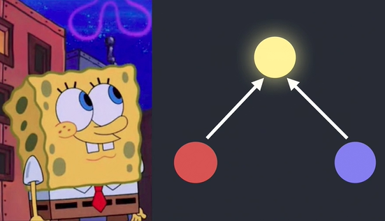 전 추상화와 함께 정말 유망하고 타당하게 시작하는걸 수없이 봐왔습니다. 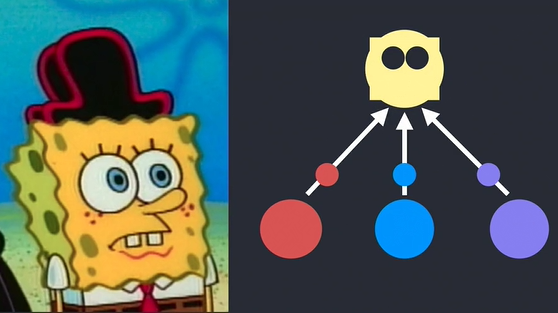 그 후 시간이 가면 갈수록 복잡해지지만 아무도 이 추상화를 리팩토링하거나 꼬인 코드를 풀어낼 시간이 없습니다. 특히나 당신이 팀의 새로운 사람이라면 말이죠. 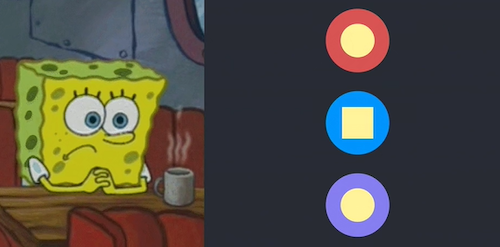 당신은 아마 이게 복사 붙여넣는 게 더 쉬울 거라고 생각하겠지만 처음 당신은 어떻게 더 해야 하는지 모를 겁니다. 왜냐면 이 코드와 친숙하지 않으니까요. 두 번째로 당신은 가장 나쁜 실천법을 제안하는 사람이 되고 싶지 않습니다. 어느 누가 _그냥 코드를 복사해서 붙여넣는게 어떤가요?_라고 말하는 사람이 되고 싶나요? 그 팀에 얼마나 오래 있을 거라고 생각합니까?

&nbsp;

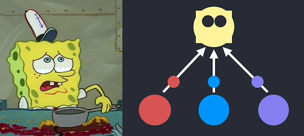
그래서 그 짓을 계속 해야하고 이 코드가 앞으로 당신의 책임이 되지않기를 희망하는 현실을 받아들일겁니다. 실제 문제는 해당 추상화가 좋지 않고 `inline`된 코드가 되어야 한다는걸 팀이 동의해도 그저 너무 늦었다는 것입니다. 아마 당신은 실제 사용법과 테스트 방식에 익숙해질지도 모릅니다. 만일 추상화를 풀어낸다면 추상화를 바꾼 후 아무것도 망가트리지않았는지 확인하는법을 이해할 수 있습니다. 하지만 만일 이걸 여기에 이용하는 다른 팀이 있고, 거기서 사용하는 또 다른 팀이 있었지만 팀이 재편성되어 아무도 이 코드를 유지보수하지 않는다면 어떻게 테스트해야하는지 정말 모를 것입니다. 당신이 원한다해도 변경하지 못할겁니다. 

&nbsp;

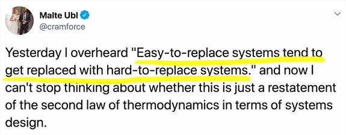
전 이 트윗을 정말 좋아합니다. 이건 좀 읽기 어렵죠. `쉽게 바뀌는 시스템`은 `어렵게 바뀌는 시스템`으로 바뀌기 쉽다. 이건 _조직의 모든 사람들이 무능해질때까지 계속해서 진급하는_ 피터의 원칙과 같습니다. 그리고 만일 어떤게 쉽게 대체된다면 아마 그건 바뀐다는 것과 같죠. 당신이 한계에 도달한 어떤 포인트는 그저 정돈되지않고 아무도 어떻게 동작하는지 이해못하는 곳입니다.

&nbsp;

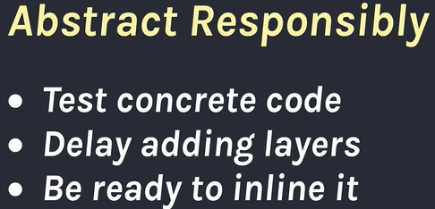
추상화를 만들면 안된다고 말하는게 아닙니다. 그건 정말 이차원적이거나 일차원적인 감상일 것입니다. 우리가 실수를 저지를거라고 말하는겁니다. 어떻게 하면 이런 위험부담을 줄이거나 완화하는 방법이 있을까요? 리액트 팀에서 배운 것 중 하나는 테스트 코드는 실제 비즈니스 값을 가지고 있다는겁니다. 우리는 조금 불안정한 추상화를 가지고있지만 버그들을 고치고 새로운 하반기가 시작되기 전 몇개를 수정할 수 있는 시간이 있기 때문에 적절한 테스트를 쓸 시간을 가질 수있습니다.

&nbsp;

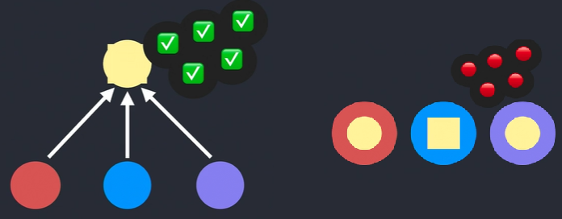
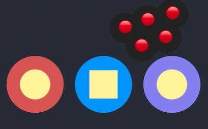
우린 그 부분을 커버하기 위해 유닛 테스트를 만들고싶어합니다. 그리고 직관적으로 어디에 유닛테스트를 넣고, 음, 여기 복잡한 코드의 추상화가 있습니다. 그러니 저 코드를 커버하기 위한 유닛테스트를 넣죠. 제 의견으로는 사실 좋지 않은 생각입니다. 나중에 이 추상화가 좋지 않다고 결정한다면 카피&페이스트로 바꾸려고 하겠죠. 네, 테스트들이 어떻게 될 것 같습니까? 모두 실패할 테죠. 당신은 이제, 음, 전 모든 테스트를 새로 만들고 싶지 않으니 모두 복구할 것입니다. 전 코드 커버리지가 낮아지는 걸 제안하는 사람이 되고 싶지 않아요. 그러니 당신도 하지 않겠죠.
