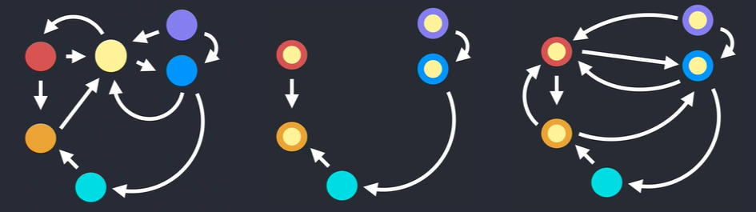
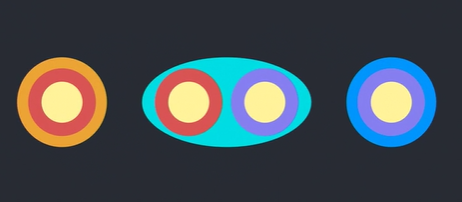

하지만 타임머신을 타고 돌아간다면 당신은 유닛테스트를 적는다거나 통합 테스트, 당신이 하고싶은 어떤 것이든, 오늘날 유행하는 테스트들, 우리가 실제로 신경 쓰는 코드에 대한 구체적인 기능에 관련된 동작을 하겠죠. 그리고는 추상화는 고려하지 않은 테스트들이 있을 겁니다. 그럼으로써 당신은 inline 추상화를 돌려놓을 수 있겠죠. 당신은 5계층의 추상화를 만들 수 있습니다. 그 테스트는 아마 그 코드가 동작하든 말든 결과를 보여주겠죠. 그 테스트들은 당신의 리팩토링 가이드가 될 겁니다. 하나에 부합하는지에 대한 지표가 될 테니까요. 구체적인 코드를 테스트하는 건 좋은 전략입니다.

또 다른 하나는 그저 당신을 제지하는 겁니다. 당신은 모든 리퀘스트를 보죠. 당신은 근질거리게, 이게 복제되어 보인다는 걸 압니다. 그리고 당신은 마치 아뇨, 산책하고 오겠죠. 왜냐면 만일, 마치 사춘기의 끌림처럼 Last'fm_(spotify같은 사이트)_의 무명밴드에 빠지는 것과 같은 거죠. 그건 당신이 많은 상식과 그들이 정말 좋은 삶의 동반자가 된다는 걸 뜻하지는 않아요. 그래서 아마도 당신은 그저 두 개의 snippet 구조가 비슷해 보인다고 해서, 그게 만을 당신이 정말 이해하지 못하는 문제가 아직 없다고 해서, 코드에 같은 짓을 하려 하진 않을 겁니다. 그리고 어떤 때에는 실제로 그게 같은 문제이거나 그저 우연히 같은 코드가 아니라고 해도 말이죠.

마지막으로, 제 생각을 말하자면 만일 문제가 일어나거나, 실수를 저지르거나, 일부 팀 문화가 그리해도 괜찮다거나, 추상화가 나쁘다고 하더라도 이건 중요하다고 생각합니다. 우린 그걸 없앨 필요가 있습니다. 당신이 추상화를 추가할 뿐만 아니라 건강한 개발 프로세스를 위해 삭제해야 하죠. 그래서 이건 _야, 이건 통제 범위 밖이야_라고 코멘트를 남겨놔도 괜찮을 거란 뜻입니다. 가끔 복사 붙여넣기에 시간을 보내고 나중에 어떻게 하면 좋을지 생각해볼 겁니다.

하지만 여긴 기술적인 요소가 또 있죠. 당신의 의존성 트리가 이것과 같아 보인다면 어떤 거든 inline 하기 꽤 힘들 수도 있습니다. 음, 전 inline을 하고 싶은 게 있고, 네, 전 복사할 수 있지만 어떤 변하기 쉬운 공유되는 상태가 있고 이제 복제되기로 했다면 말이죠. 전 어떻게 모든 의존성 들을 함께 다시 쓸 수 있는지 알아낼 필요가 있습니다. 이건 아마도 실현할 수 없을지도 모르죠. 그저 포기할 겁니다. 전 정말 좋은 해결책을 모르겠어요. 제가 알아차린 건 어떤 코드에선 정말 피할 수 없다는 겁니다. 예를 들어 `리액트`에 어떤 소스 코드가 있고 이런 문제들이 있습니다. 왜냐면 변형시키면 안 되는걸 변형시키려 하니까요. 생각하기 조금 어려울 수 있는 모듈 간 모든 상호 의존성 들을 가지게 되었습니다.

하지만 제 생각에 `리액트`의 멋진 점은 당신이 만든 앱과 의존성 트리가 더 이것과 같아지게 할 수 있다는 거죠. 그래서 `button component`는 `form`에서 사용되고 `app`에서 `form`이 사용되는 거죠. 이렇게요. 이건 트리 모양을 따릅니다. 우린 일방통행의 데이터 흐름 제약을 가지고 있습니다. 실수를 저지르고, 못 쓰는 추상화를 만드는 등의 정말 이상한 순환을 예상하지 못하죠. 하지만 이것들을 없앨 때 당신의 기술은 더 편해질까요?

왜냐면 제 생각에 `리액트 컴포넌트`와 `management`와 같은 폼들에 대한 다른 제약조건이 있기 때문에 보통은 `property`에 `inline`을 위한 복사 붙여넣기 같은걸 하기 좋습니다. 나쁜 결정을 하더라도 너무 늦기 전에 되돌릴 수 있습니다. 이건 사회적, 기술적 부분을 모두 고려한 것이죠. _반복하지 마라 (don't repeat yourself)_. 아마도 `DRY`는 꽤 좋은 발상 중 그저 하나의 원칙일 뿐입니다.

개발자와 이 산업에 들어올 때 들었을지도 모르는 좋은 발상들이 있습니다. 아니면 심지어 어떤 사람들은 15살에 시작했고 불과 몇 달 만에 도약합니다. 우린 이런 것들 주위에 정말 많은 전도 활동을 봅니다. 괜찮아요. 하지만 우리가 이런 것들을 설명하려 할 때나 이게 왜 좋은 생각인지, 정확히 무엇을 팔려 하고 어떤 것들이 우리를 그 원칙이나 아이디어로 이끈 것인지 늘 설명하려 할 때 중요합니다. 이런 문제들은 유통기한이 언젤까요? 가끔가다 당신이 인지하지 못했지만, 전후 사정이 바뀌었을 거라고 추정하는 어떤 맥락이 있기 때문이죠. 다음 세대는 어떤 균형을 유지했고 왜 그랬는지를 정확히 이해할 필요가 있습니다.

당신에게 하는 마지막 제 도전은 당신이 늘 맞는다고 강하게 믿거나 경험에 따른 어떤 모범 사례와 안티 패턴을 뽑는 것입니다. 누군가가 당신에게 말했거나 직접 생각해냈거나, 왜 당신이 그것들을 믿고 분해하고 해체하려는 것이나 어떤 걸 정확히 교환하려 하기 때문입니다. 만약 당신이 이 강연의 재미를 찾았다면 다른 사람들에게 이런 걸 말하세요. Sandi Metz의 _All the Little Things_는 이런 발상과 다른 많은 아이디어에 대해 더 자세히 설명하는 놀라운 강연입니다. _Minimal API Surface Area_는 제게 이 모든 걸 가르쳐준 동료 Sebastian의 강연입니다. 그리고 On the Spectrum of Abstraction은 어떻게 추상화가 제약 조건에 대한 표현력과 힘을 교환하는 데 도움이 되는지, 어떻게 제약조건이 우리를 제한하고 그렇지 않으면 할 수 없는 일을 하게 만드는지에 관해 설명해주는 Cheng Lou의 흥미로운 강연입니다. 좋은 이야기였습니다. 반겨주셔서 감사합니다. 이게 제가 아는 전부입니다.
